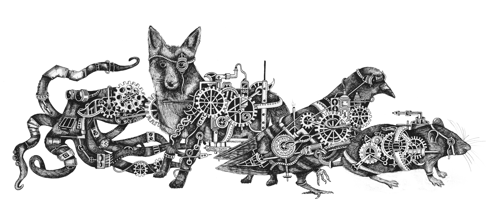

# Animal-AI Olympics

<p align="center">
  
</p>

**July 1st - November 1st**

The Animal-AI Olympics is an AI competition with tests inspired by animal cognition. Participants are given a small environment with just seven different classes of objects that can be placed inside. In each test, the agent needs to retrieve the food in the environment, but to do so there are obstacles to overcome, ramps to climb, boxes to push, and areas that must be avoided. The real challenge is that we don't provide the tests in advance. It's up to you to explore the possibilities with the environment and build interesting configurations that can help create an agent that understands how the environment's physics work and the affordances that it has. The final submission should be an agent capable of robust food retrieval behaviour similar to that of many kinds of animals. We know the animals can pass these tests, it's time to see if AI can too.

## Prizes $32,000 (equivalent value)

* Overall Prizes
  * 1st place overall: **$7,500 total value** - $6,500 with up to $1,000 travel to speak at NeurIPS 2019.
  * 2nd place overall: **$6,000 total value** - $5,000 with up to $1,000 travel to speak at NeurIPS 2019.
  * 3rd place overall: **$1,500**.
* WBA-Prize: **$5,000 total value** - $4,000 with up to $1,000 travel to speak at NeurIPS 2019
* Category Prizes: **$200** For best performance in each category (cannot combine with other prizes - max 1 per team).
* ~~**Mid-way AWS Research Credits**: The top 20 entries as of **September 1st** will be awarded **$500** of AWS credits.~~ (already awarded)

See [competition launch page](https://mdcrosby.com/blog/animalailaunch.html) and official rules for further details.

**Important** Please check the competition rules [here](http://animalaiolympics.com/rules.html). **To submit to the competition and be considered for prizes you must also fill in [this form](https://forms.gle/PKCgp2JAWvjf4c9i6)**. Entry to the competition ([via EvalAI](https://evalai.cloudcv.org/web/challenges/challenge-page/396/overview)) constitutes agreement with all competition rules. 

## Overview

Here you will find all the code needed to compete in this new challenge. This repo contains **the training environment** (v1.0) that will be used for the competition. Information for entering can be found in the [submission documentation](documentation/submission.md). Please check back during the competition for minor bug-fixes and updates, but as of v1.0 the major features and contents are set in place.

For more information on the competition itself and to stay updated with any developments, head to the 
[Competition Website](http://www.animalaiolympics.com/) and follow [@MacroPhilosophy](https://twitter.com/MacroPhilosophy) and [@BenBeyret](https://twitter.com/BenBeyret) on twitter.

The environment contains an agent enclosed in a fixed sized arena. Objects can spawn in this arena, including positive 
and negative rewards (green, yellow and red spheres) that the agent must obtain (or avoid). All of the hidden tests that will appear in the competition are made using the objects in the training environment. We have provided some sample environment configurations that should be useful for training (see examples/configs), but part of the challenge is to experiment and design new configurations.

To get started install the requirements below, and then follow the [Quick Start Guide](documentation/quickstart.md). 
More in depth documentation can be found on the [Documentation Page](documentation/README.md).

## Evaluation

The competition has 300 tests, split over ten categories. The categories range from the very simple (e.g. **food retrieval**, **preferences**, and **basic obstacles**) to the more complex (e.g. **spatial reasoning**, **internal models**, **object permanence**, and **causal reasoning**). We have included example config files for the first seven categories. Note that the example config files are just simple examples to be used as a guide. An agent that solves even all of these perfectly may still not be able to solve all the tests in the category, but it would be off to a good start.

The submission website allows you to submit an agent that will be run on all 300 tests and it returns the overall score (number of tests passed) and score per category. We cannot offer infinite compute, so instances will be timed out after ~90 minutes and only tests performed up to that point counted (all others will be considered failed). See the [submission documentation](documentation/submission.md) for more information. 

For the mid-way and final evaluation we will (resources permitting) run more extensive testing with 3 variations per test (so 900 tests total). The variations will include minor perturbations to the configurations. The agent will have to pass all 3 variations to pass each individual test, giving a total score out of 300. This means that **your final test score might be lower than the score achieved during the competition** and that **the competition leaderboard on EvalAI may not exactly match the final results**. 

## Development Blog

You can read the launch posts - with information about prizes and the categories in the competition here:

[Animal-AI: AWS Prizes and Evaluation: Aug 12th](https://www.mdcrosby.com/blog/animalaiprizes1.html) - with updated submission and test information.

[Animal-AI Evaluation: July 8th](https://mdcrosby.com/blog/animalaieval.html) - with collated information about the evaluation.

[Animal-AI Launch: July 1st](https://mdcrosby.com/blog/animalailaunch.html) - with information about the prizes and  introduction to all 10 categories.

You can read the development blog [here](https://mdcrosby.com/blog). It covers further details about the competition as 
well as part of the development process.

1. [Why Animal-AI?](https://mdcrosby.com/blog/animalai1.html)

2. [The Syllabus (Part 1)](https://mdcrosby.com/blog/animalai2.html)

3. [The Syllabus (Part 2): Lights Out](https://mdcrosby.com/blog/animalai3.html)

## Requirements

The Animal-AI package works on Linux, Mac and Windows, as well as most Cloud providers. Note that for submission to the competition we only support linux-based Docker files.  
<!--, for cloud engines check out [this cloud documentation](documentation/cloud.md).-->

We recommend using a virtual environment specifically for the competition. You will need `python3.6` installed (we currently only support **python3.6**). Clone this repository to run the examples we provide.

We offer two packages for this competition:

- The main package is an API for interfacing with the Unity environment. It contains both a 
[gym environment](https://github.com/openai/gym) as well as an extension of Unity's 
[ml-agents environments](https://github.com/Unity-Technologies/ml-agents/tree/master/ml-agents-envs). You can install it
 via pip:
    ```
    pip install animalai
    ```
    Or you can install it from the source, head to `animalai/` folder and run `pip install -e .`

    In case you wish to create a conda environment you can do so by running the below command from the `animalai` folder:
    ```
    conda env create -f conda_isntall.yaml
    ```

- We also provide a package that can be used as a starting point for training, and which is required to run most of the 
example scripts found in the `examples/` folder. At the moment **we only support Linux and Max** for the training examples. It contains an extension of 
[ml-agents' training environment](https://github.com/Unity-Technologies/ml-agents/tree/master/ml-agents) that relies on 
[OpenAI's PPO](https://openai.com/blog/openai-baselines-ppo/), as well as 
[Google's dopamine](https://github.com/google/dopamine) which implements 
[Rainbow](https://www.aaai.org/ocs/index.php/AAAI/AAAI18/paper/download/17204/16680) (among others). You can also install 
this package using pip:
    ```
    pip install animalai-train
    ```
    Or you can install it from source, head to `examples/animalai_train` and run `pip install -e .`

Finally download the environment for your system:

| OS | Environment link |
| --- | --- |
| Linux |  [download v1.0.0](https://www.doc.ic.ac.uk/~bb1010/animalAI/env_linux_v1.0.0.zip) |
| MacOS |  [download v1.0.0](https://www.doc.ic.ac.uk/~bb1010/animalAI/env_mac_v1.0.0.zip) |
| Windows | [download v1.0.0](https://www.doc.ic.ac.uk/~bb1010/animalAI/env_windows_v1.0.0.zip)  |

You can now unzip the content of the archive to the `env` folder and you're ready to go! Make sure the executable 
`AnimalAI.*` is in `env/`. On linux you may have to make the file executable by running `chmod +x env/AnimalAI.x86_64`. 
Head over to [Quick Start Guide](documentation/quickstart.md) for a quick overview of how the environment works.

The Unity source files for the environment can be find on the [AnimalAI-Environment repository](https://github.com/beyretb/AnimalAI-Environment). 
Due to a lack of resources we cannot provide support on this part of the project at the moment. We recommend reading the documentation on the 
[ML-Agents repo](https://github.com/Unity-Technologies/ml-agents) too.

## Manual Control

If you launch the environment directly from the executable or through the VisualizeArena script it will launch in player 
mode. Here you can control the agent with the following:

| Keyboard Key  | Action    |
| --- | --- |
| W   | move agent forwards |
| S   | move agent backwards|
| A   | turn agent left     |
| D   | turn agent right    |
| C   | switch camera       |
| R   | reset environment   |

## Citing
If you use the Animal-AI environment in your work you can cite the environment paper:

Beyret, B., Hernández-Orallo, J., Cheke, L., Halina, M., Shanahan, M., Crosby, M. [The Animal-AI Environment: Training and Testing Animal-Like Artificial Cognition](https://arxiv.org/abs/1909.07483), arXiv preprint

```
@inproceedings{Beyret2019TheAE,
  title={The Animal-AI Environment: Training and Testing Animal-Like Artificial Cognition},
  author={Benjamin Beyret and Jos'e Hern'andez-Orallo and Lucy Cheke and Marta Halina and Murray Shanahan and Matthew Crosby},
  year={2019}
}
```

Paper with all the details of the test battery will be released after the competition has finished.

## Unity ML-Agents

The Animal-AI Olympics was built using [Unity's ML-Agents Toolkit.](https://github.com/Unity-Technologies/ml-agents)

The Python library located in [animalai](animalai) is almost identical to 
[ml-agents v0.7](https://github.com/Unity-Technologies/ml-agents/tree/master/ml-agents-envs). We only added the 
possibility to change the configuration of arenas between episodes. The documentation for ML-Agents can be found 
[here](https://github.com/Unity-Technologies/ml-agents/blob/master/docs/Python-API.md).

Juliani, A., Berges, V., Vckay, E., Gao, Y., Henry, H., Mattar, M., Lange, D. (2018). [Unity: A General Platform for 
Intelligent Agents.](https://arxiv.org/abs/1809.02627) *arXiv preprint arXiv:1809.02627*

## EvalAI

The competition is kindly hosted on [EvalAI](https://github.com/Cloud-CV/EvalAI), an open source web application for AI competitions. Special thanks to [Rishabh Jain](https://github.com/RishabhJain2018) for his help in settting this up.

Deshraj Yadav, Rishabh Jain, Harsh Agrawal, Prithvijit Chattopadhyay, Taranjeet Singh, Akash Jain, Shiv Baran Singh, Stefan Lee and Dhruv Batra (2019) [EvalAI: Towards Better Evaluation Systems for AI Agents](https://arxiv.org/abs/1902.03570)

## Known Issues

In play mode pressing `R` or `C` does nothing sometimes. This is due to the fact that we have synchronized these 
features with the agent's frames in order to have frames in line with the configuration files for elements such as blackouts. **Solution**: press the key again, several times if needed.

## TODO

- [x] Add custom resolutions
- [x] Add inference viewer to the environment
- [x] Offer a gym wrapper for training
- [x] Improve the way the agent spawns
- [x] Add lights out configurations.
- [x] Improve environment framerates
- [x] Add moving food

## Version History

- v1.1.1
    - Hotfix curriculum loading in the wrong order
    
- v1.1.0
    - Add curriculum learning to `animalai-train` to use yaml configurations

- v1.0.5
    - ~~Adds customisable resolution during evaluation~~ (removed, evaluation is only `84x84`)
    - Update `animalai-train` to tf 1.14 to fix `gin` broken dependency
    - Release source code for the environment (no support to be provided on this for now)
    - Fixes some legacy dependencies and typos in both libraries
    
- v1.0.3
    - Adds inference mode to Gym environment
    - Adds seed to Gym Environment
    - Submission example folder containing a trained agent
    - Provide submission details for the competition
    - Documentation for training on AWS

- v1.0.2
    - Adds custom resolution for docker training as well
    - Fix version checker

- v1.0.0
    - Adds custom resolution to both Unity and Gym environments
    - Adds inference mode to the environment to visualize trained agents
    - Prizes announced
    - More details about the competition

- v0.6.1 (Environment only) 
    - Fix rare events of agent falling through the floor or objects flying in the air when resetting an arena

- v0.6.0 
    - Adds score in playmode (current and previous scores)
    - Playmode now incorporates lights off directly (in `examples` try: `python visualizeArena.py configs/lightsOff.yaml`)
    - To simplify the environment several unnecessary objects have been removed [see here](documentation/definitionsOfObjects.md)
    - **Several object properties have been changed** [also here](documentation/definitionsOfObjects.md)
    - Frames per action reduced from 5 to 3 (*i.e.*: for each action you send we repeat it for a certain number of frames 
    to ensure smooth physics)
    - Add versions compatibility check between the environment and API
    - Remove `step_number` argument from `animalai.environment.step`

- v0.5 Package `animalai`, gym compatible, dopamine example, bug fixes
    - Separate environment API and training API in Python
    - Release both as `animalai` and `animalai-train` PyPI packages (for `pip` installs)
    - Agent speed in play-mode constant across various platforms
    - Provide Gym environment
    - Add `trainBaselines,py` to train using `dopamine` and the Gym wrapper
    - Create the `agent.py` interface for agents submission
    - Add the `HotZone` object (equivalent to the red zone but without death)

- v0.4 - Lights off moved to Unity, colors configurations, proportional goals, bugs fixes
    - The light is now directly switched on/off within Unity, configuration files stay the same
    - Blackouts now work with infinite episodes (`t=0`)
    - The `rand_colors` configurations have been removed and the user can now pass `RGB` values, see 
    [here](documentation/configFile.md#objects)
    - Rewards for goals are now proportional to their size (except for the `DeathZone`), see 
    [here](documentation/definitionsOfObjects.md#rewards)
    - The agent is now a ball rather than a cube
    - Increased safety for spawning the agent to avoid infinite loops
    - Bugs fixes
    
- v0.3 - Lights off, remove Beams and add cylinder
    - We added the possibility to switch the lights off at given intervals, see 
    [here](documentation/configFile.md#blackouts)
    - visualizeLightsOff.py displays an example of lights off, from the agent's point of view
    - Beams objects have been removed
    - A `Cylinder` object has been added (similar behaviour to the `Woodlog`)
    - The immovable `Cylinder` tunnel has been renamed `CylinderTunnel`
    - `UnityEnvironment.reset()` parameter `config` renamed to `arenas_configurations_input`
    
- v0.2 - New moving food rewards, improved Unity performance and bug fixes 
    - Moving rewards have been added, two for each type of reward, see 
    [the details here](documentation/definitionsOfObjects.md#rewards).
    - Added details for the maze generator.
    - Environment performance improved.
    - [Issue #7](../../issues/7) (`-inf` rewards for `t: 0` configuration) is fixed.

- v0.1 - Initial Release

