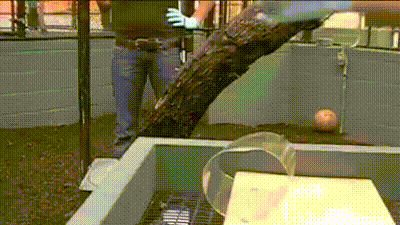
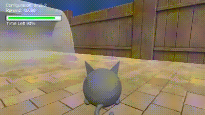
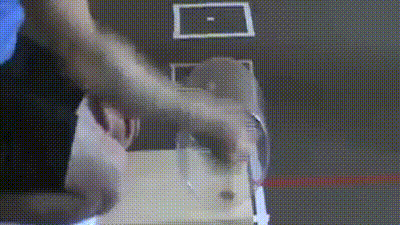

# Animal-AI 2.0.0

<p align="center">
  
</p>


|  |  |
|---|---|
|  |  |

## Overview

The [Animal-AI](http://animalaiolympics.com/AAI) is a project which introduces the study of animal cognition to the world of AI. 
The aim is to provide an environment for testing agents on tasks taken from or inspired by the animal cognition literature.
Decades of research in this field allow us to train and test for cognitive skills in Artificial Intelligence agents.

This repo contains the [training environment](animalai), a [training library](animalai_train) as well as [900 tasks](competition_configurations) for testing and/or training agents.
The experiments are divided into categories meant to reflect various cognitive skills, the details can be found on the [website](http://animalaiolympics.com/AAI/testbed).

We ran a competition using this environment and the associated tests, more details about the results can be found [here](http://animalaiolympics.com/AAI/2019)

The environment is built using [Unity ml-agents](https://github.com/Unity-Technologies/ml-agents/tree/master/docs) and contains an agent enclosed in a fixed sized arena. Objects can spawn in this arena, including positive 
and negative rewards (green, yellow and red spheres) that the agent must obtain (or avoid). All of the hidden tests that will appear in the competition are made using the objects in the training environment. 

To get started install the requirements below, and then follow the jupyter notebook tutorials in the [examples folder](examples). 
More in depth documentation can be found on the [Documentation Page](documentation/README.md).

## Development Blog

You can read the launch posts - with information about prizes and the categories in the competition here:

[Animal-AI: AWS Prizes and Evaluation: Aug 12th](https://www.mdcrosby.com/blog/animalaiprizes1.html) - with updated submission and test information.

[Animal-AI Evaluation: July 8th](https://mdcrosby.com/blog/animalaieval.html) - with collated information about the evaluation.

[Animal-AI Launch: July 1st](https://mdcrosby.com/blog/animalailaunch.html) - with information about the prizes and  introduction to all 10 categories.

You can read the development blog [here](https://mdcrosby.com/blog). It covers further details about the competition as 
well as part of the development process.

1. [Why Animal-AI?](https://mdcrosby.com/blog/animalai1.html)

2. [The Syllabus (Part 1)](https://mdcrosby.com/blog/animalai2.html)

3. [The Syllabus (Part 2): Lights Out](https://mdcrosby.com/blog/animalai3.html)

## Requirements

The Animal-AI package works on Linux, Mac and Windows, as well as most Cloud providers, and requires python 3.

We offer two packages:

- The main package is an API for interfacing with the Unity environment. It contains both a 
[gym environment](https://github.com/openai/gym) as well as an extension of Unity's 
[ml-agents environments](https://github.com/Unity-Technologies/ml-agents/tree/master/ml-agents-envs). You can install it
 via pip:
    ```
    pip install animalai
    ```
    Or you can install it from the source by running `pip install -e animalai` from the repo folder

    <!--In case you wish to create a conda environment you can do so by running the below command from the `animalai` folder:
    ```
    conda env create -f conda_isntall.yaml
    ```-->ni    

- We also provide a package that can be used as a starting point for training, and which is required to run most of the 
example scripts found in the `examples/` folder. It contains an extension of 
[ml-agents' training environment](https://github.com/Unity-Technologies/ml-agents/tree/master/ml-agents) that relies on 
[OpenAI's PPO](https://openai.com/blog/openai-baselines-ppo/) and [BAIR's SAC](https://bair.berkeley.edu/blog/2018/12/14/sac/). You can also install this package using pip:
    ```
    pip install animalai-train
    ```
    Or you can install it from source by running `pip install -e animalai_train` from the repo folder

Finally **download the environment** for your system:

| OS | Environment link |
| --- | --- |
| Linux |  [download v2.0.0](https://www.doc.ic.ac.uk/~bb1010/animalAI/env_linux_v2.0.0.zip) |
| MacOS |  [download v2.0.0](https://www.doc.ic.ac.uk/~bb1010/animalAI/env_mac_v2.0.0.zip) |
| Windows | [download v2.0.0](https://www.doc.ic.ac.uk/~bb1010/animalAI/env_windows_v2.0.0.zip)  |

You can now unzip the content of the archive to the `env` folder and you're ready to go! Make sure the executable 
`AnimalAI.*` is in `env/`. On linux you may have to make the file executable by running `chmod +x env/AnimalAI.x86_64`. 
Head over to [Quick Start Guide](documentation/quickstart.md) for a quick overview of how the environment works.

The Unity source files for the environment can be found on our [ml-agents fork](https://github.com/beyretb/ml-agents). 

## Manual Control

If you launch the environment directly from the executable or through the VisualizeArena script it will launch in player 
mode. Here you can control the agent with the following:

| Keyboard Key  | Action    |
| --- | --- |
| W   | move agent forwards |
| S   | move agent backwards|
| A   | turn agent left     |
| D   | turn agent right    |
| C   | switch camera       |
| R   | reset environment   |

## Citing
If you use the Animal-AI environment in your work you can cite the environment paper:

Beyret, B., Hernández-Orallo, J., Cheke, L., Halina, M., Shanahan, M., Crosby, M. [The Animal-AI Environment: Training and Testing Animal-Like Artificial Cognition](https://arxiv.org/abs/1909.07483), arXiv preprint

```
@inproceedings{Beyret2019TheAE,
  title={The Animal-AI Environment: Training and Testing Animal-Like Artificial Cognition},
  author={Benjamin Beyret and Jos'e Hern'andez-Orallo and Lucy Cheke and Marta Halina and Murray Shanahan and Matthew Crosby},
  year={2019}
}
```

Paper with all the details of the test battery will be released after the competition has finished.

## Unity ML-Agents

The Animal-AI Olympics was built using [Unity's ML-Agents Toolkit.](https://github.com/Unity-Technologies/ml-agents)

The Python library located in [animalai](animalai) extends [ml-agents v0.15.0](https://github.com/Unity-Technologies/ml-agents/tree/0.15.0). Mainly, we add the 
possibility to change the configuration of arenas between episodes. 

Juliani, A., Berges, V., Vckay, E., Gao, Y., Henry, H., Mattar, M., Lange, D. (2018). [Unity: A General Platform for 
Intelligent Agents.](https://arxiv.org/abs/1809.02627) *arXiv preprint arXiv:1809.02627*

## EvalAI

The competition was kindly hosted on [EvalAI](https://github.com/Cloud-CV/EvalAI), an open source web application for AI competitions. Special thanks to [Rishabh Jain](https://rishabhjain.xyz/) for his help in setting this up.
We will aim to reopen submissions with new hidden files in order to keep some form of competition going.

Deshraj Yadav, Rishabh Jain, Harsh Agrawal, Prithvijit Chattopadhyay, Taranjeet Singh, Akash Jain, Shiv Baran Singh, Stefan Lee and Dhruv Batra (2019) [EvalAI: Towards Better Evaluation Systems for AI Agents](https://arxiv.org/abs/1902.03570)


## Version History

-v2.0.0:
    - fix small bugs
    - adds tutorial notebooks

- v2.0.0b0 (beta)
    - Bump ml-agents from 0.7 to 0.15 which:
        - allows multiple parallel environments for training
        - adds Soft actor critic (SAC) trainer
        - has a new kind of actions/observations loop (on demand decisions)
        - removes brains and some protobufs
        - adds side-channels to replace some protobufs
        - refactoring of the codebase
    - GoodGoalMulti are now yellow with the same texture (light emitting) as GoodGoal and BadGoal
    - The whole project including the Unity source is now available on [our ml-agents fork](https://github.com/beyretb/ml-agents)

For earlier versions see [here](documentation/versions.md)
