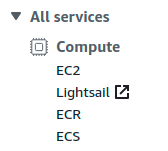
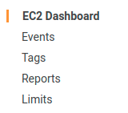
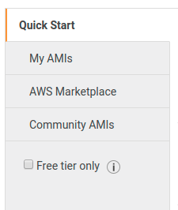
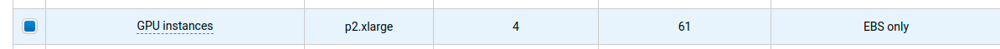

# Training on AWS

Training an agent requires rendering the environment on a screen, which means that you may have to follow a few steps (detailed below) before you can use standard cloud compute instances. We detail two possibilities. Both methods were tested on [AWS p2.xlarge](https://aws.amazon.com/ec2/instance-types/p2/) using a standard [Deep Learning Base AMI](https://aws.amazon.com/marketplace/pp/B077GCZ4GR). 

We leave participants the task of adapting the information found here to different cloud providers and/or instance types or for their specific use-case. We do not have the resources to fully support this capability. We are providing the following purely in the hopes it serves as a useful guide for some.

**WARNING: using cloud services will incur costs, carefully read your provider terms of service**

## Pre-requisite: setup an AWS p2.xlarge instance

Start by creating an account on [AWS](https://aws.amazon.com/), and then open the [console](https://console.aws.amazon.com/console/home?). 
Compute engines on AWS are called `EC2` and offer a vast range of configurations in terms of number and type of CPUs, GPUs, 
memory and storage. You can find more details about the different types and prices [here](https://aws.amazon.com/ec2/pricing/on-demand/). 
In our case, we will use a `p2.xlarge` instance, in the console select `EC2`:



by default you will have a limit restriction on the number of instances you can create. Check your limits by selecting `Limits` on the top 
left menu:



Request an increase for `p2.xlarge` if needed. Once you have at least a limit of 1, go back to the EC2 console and select launch instance:


You can then select various images, type in `Deep learning` to see what is on offer, for now we recommend to select `AWS Marketplace` on the left panel:



and select either `Deep Learning Base AMI (Ubuntu)` if you want a basic Ubuntu install with CUDA capabilities. On the next page select `p2.xlarge` (this will not be selected by default):



Click `Next` twice (first Next: Configure Instance Deatils, then Next: Add Storage) and add at least 15 Gb of storage to the current size (so at least 65 total with a default of 50). Click `review and launch`, and then `launch`. You will then be asked to create or select existing key pairs which will be used to ssh to your instance.

Once your instance is started, it will appear on the EC2 console. To ssh into your instance, right click the line, select connect and follow the instructions. 
We can now configure our instance for training. **Don't forget to shutdown your instance once you're done using it as you get charged as long as it runs**.

## Simulating a screen

As cloud engines do not have screens attached, rendering the environment window is impossible. We use a virtual screen instead, in the form of [xvfb](https://en.wikipedia.org/wiki/Xvfb). 
You can follow either one of the following methods to use this. In both, **remember** to select `docker_training=True` in your environment configuration.


## Method 1: train using docker

Basic Deep Learning Ubuntu images provide [NVIDIA docker](https://devblogs.nvidia.com/nvidia-docker-gpu-server-application-deployment-made-easy/) 
pre-installed, which allows the use of CUDA within a container. SSH into your AWS instance, clone this repo and follow the instructions below.

In the [submission guide](submission.md) we describe how to build a docker container for submission. The same process 
can be used to create a docker for training an agent. The [dockerfile provided](../examples/submission/Dockerfile) can 
be adapted to include all the libraries and code needed for training.

For example, should you wish to train a standard Dopamine agent provided in `animalai-train` out of the box, using GPU compute, add the following 
lines to your docker in the `YOUR COMMANDS GO HERE` part, below the line installing `animalai-train`:

```
RUN git clone https://github.com/beyretb/AnimalAI-Olympics.git
RUN pip uninstall --yes tensorflow
RUN pip install tensorflow-gpu==1.14
RUN apt-get install unzip wget
RUN wget https://www.doc.ic.ac.uk/~bb1010/animalAI/env_linux_v1.0.0.zip
RUN mv env_linux_v1.0.0.zip AnimalAI-Olympics/env/
RUN unzip AnimalAI-Olympics/env/env_linux_v1.0.0.zip -d AnimalAI-Olympics/env/
WORKDIR /aaio/AnimalAI-Olympics/examples
RUN sed -i 's/docker_training=False/docker_training=True/g' trainDopamine.py
```

Build your docker, from the `examples/submission` folder run:

```
docker build --tag=test-training .
```

Once built, you can start training straight away by running:

```
docker run --runtime=nvidia test-training python trainDopamine.py
```

Notice the use of `--runtime=nvidia` which activates CUDA capabilities. You should see the following tensorflow line in the output 
which confirms you are training using the GPU:

```
I tensorflow/core/common_runtime/gpu/gpu_device.cc:1432] Found device 0 with properties: 
name: Tesla K80 major: 3 minor: 7 memoryClockRate(GHz): 0.823
```

You're now ready to start training on AWS using docker!

## Method 2: install xvfb on the instance

An alternative to docker is to install `xvfb` directly on your AWS instance and use it in the same way you would when training on your home computer. For this you will want to install an Ubuntu image with some deep learning libraries installed. From the AWS Marketplace page you can for example install `Deep Learning AMI (Ubuntu)` which contains tensorflow and pytorch.

To do so, you can follow the original ML Agents description for `p2.xlarge` found [here](https://github.com/Unity-Technologies/ml-agents/blob/master/docs/Training-on-Amazon-Web-Service.md#setting-up-x-server-optional). From our 
experience, these steps do not work as well on other types of instances.

