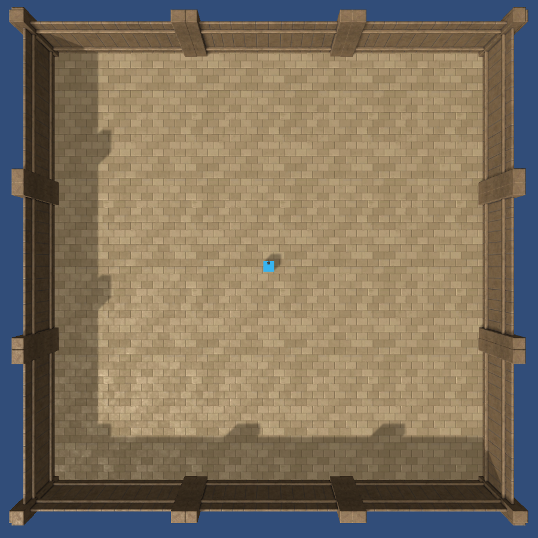

# Arena Configuration Files

## TL;DR

From the `examples` folder, run `python load_config_and_play.py configs/configExample.yaml` to get an understanding of how the `YAML` files configure the 
arenas for training. You will find a list of all objects you can add to an arena as well as the values for their 
parameters in [the definitions](definitionsOfObjects.md). You will find below all the technical details to create 
more complex training configurations.

## Intro
To configure training arenas you can use a simple **YAML file** and/or the **ArenaConfig structure** provided in 
`animalai.envs.arena_config`. This makes training quite flexible and allows for the following:
- load and save configurations for reusability
- on the fly changes of configuration of one or more arenas between episodes, allowing for easy curriculum learning for example
- share configurations between participants

We describe below the structure of the configuration files for an instance of the training environment, as well as all the 
parameters and the values they can take. 
## The Arenas

<p align="center">
  
</p>

A single arena is as shown above, it comes with a single agent (blue sphere, black dot showing the front), a floor and 
four walls. It is a square of size 40x40, the origin of the arena is `(0,0)`. You can provide coordinates for 
objects in the range `[0,40]x[0,40]` as floats.

Note that in Unity the **y** axis is the vertical axis. In the above picture with the agent on the ground in the center of the environment its coordinates are (20, 0, 20).

For visualization you can only configure a single arena, however during training you can configure as many as you want, 
each will have its local set of coordinates as described above.

For a single arena you can provide the following parameters:
- `t` an `int`, the length of an episode which can change from one episode to the other. A value of `0` means that the episode will 
not terminate until a reward has been collected (setting `t=0` and having no reward will lead to an infinite episode)
- `blackouts` [see below](#blackouts)
- `pass_mark` the score the agent needs to reach to pass the level

## Objects

All the objects that will be used during training are provided to you for training. All objects can be configured in the 
same manner, using a set of parameters for each item:

- `name`: the name of the object you want to spawn.
- `positions`: a list of `Vector3` positions within the arena where you want to spawn items, if the list 
is empty the position will be sampled randomly in the aren. Any position dimension set to -1 will spawn randomly.
- `sizes`: a list of `Vector3` sizes, if the list is empty the size will be sampled randomly. You can set any size to -1 to spawn randomly along that dimension only.
- `rotations`: a list of `float` in the range `[0,360]`, if the list is empty the rotation is sampled randomly.
- `colors`: a list of `RGB` values (integers in the range `[0,255]`), if the list is empty the color is sampled randomly.

Any of these fields can be omitted in the configuration files, in which case the omitted fields are automatically randomized. Any Vector3 that contains a -1 for any of its dimensions will spawn that dimension randomly. This can be used to spawn, for example, multiple walls of a set width and height but random lengths. 

**All value ranges for the above fields can be found in [the definitions](definitionsOfObjects.md)**. If you go above or below the range for size it will automatically be set to the max or min respectively. If you try to spawn outside the arena (or overlapping with another object) then nothing will spawn.

## Blackouts

Blackouts are parameters you can pass to each arena, which define between which frames of an episode the lights are 
on or off. If omitted, this parameter automatically sets to have lights on for the entire episode. You can otherwise 
pass two types of arguments for this parameter:

- passing a list of frames `[5,10,15,20,25]` will start with the lights on, switch them off from frames 5 to 9 included, 
then back on from 15 to 19 included etc...
- passing a single negative argument `[-20]` will automatically switch lights on and off every 20 frames.

**Note**: for infinite episodes (where `t=0`), the first point above would leave the light off after frame `25` while the second point would keep switching the lights every `20` frames indefinitely.


## Rules and Notes
There are certain rules to follow when configuring and arena as well as some designs you should be aware of. If a 
configuration file does not behave as you expect make sure you're not breaking one of the following:

- Spawning objects:
    - **Objects can only spawn if they do not overlap with each other**. Attempting to spawn an object where another object already is will discard the latter.
    - The environment will attempt to spawn objects in the order they are provided in the file. In the case where any of the components is randomized we attempt to spawn the object **up to 20 times**. if no valid spawning spot is found the object is discarded.
    - Due to the above point, the first objects in the list are more likely to spawn than the last ones.
    - The `Agent` does not have to be provided in the configuration file, in which case it will spawn randomly.
    - If an `Agent` position is provided, be aware that the **agent spawns last** therefore it might cause problems if other objects randomly spawn where the agent should be.
    - In case an object is present where the `Agent` should spawn the arena resets and the process starts all over.
    - You can **spawn some objects on top of each others**, however be aware there is a `0.1` buffer automatically added to any height you provide (to make sure things fall on each others nicely). 

- Configuration file values:
    - Objects' `name` have to match one of the names provided in [the definitions](definitionsOfObjects.md), if the name provided is not found in this list, the object is ignored.
    - Any component of `positions`, `sizes` and `rotations` can be randomized by providing a value of `-1`.
    - Note that setting `positions.y = -1` will spawn the object at ground level.
    - Goals (except for the red zone) can only be scaled equally on all axes, therefore they will always remain spheres. If a `Vector3` is provided for the scale of a sphere goal only the `x` component is used to scale all axes equally.
    
## Detailed example

Let's take a look at an example:

```
!ArenaConfig
arenas:
  0: !Arena
    t: 0
    items:
    - !Item
      name: Wall
      positions:
      - !Vector3 {x: 10, y: 0, z: 10}
      - !Vector3 {x: -1, y: 0, z: 30}
      colors:
      - !RGB {r: 204, g: 0, b: 204 }
      rotations: [45]
      sizes:
      - !Vector3 {x: -1, y: 5, z: -1}
    - !Item
      name: CylinderTunnel
      colors:
      - !RGB {r: 204, g: 0, b: 204 }
      - !RGB {r: 204, g: 0, b: 204 }
      - !RGB {r: 204, g: 0, b: 204 }
    - !Item
      name: GoodGoal
```

First of all, we can see that the number of parameters for `positions`, `rotations` and `sizes` do not need to match. The environment will spawn `max( len(positions), len(rotations), len(sizes) )` objects, where `len()` is the length of the list. Any mising parameter will correspond to a randomly generated value.

In this case this will lead to (in order that they will spawn):
- a pink `Cube` spawned at `[10,10]` on the ground with rotation `45` and a size randomized on both `x` and `z` and of `y=5`.
- a `Cube` spawned on the ground, with a random `x` and `z=30`. Its rotation, size  and color will be random.
- three pink `CylinderTunnel` completely randomized.
- a `GoodGoal` randomized.
- the agent with position and rotation randomized.
