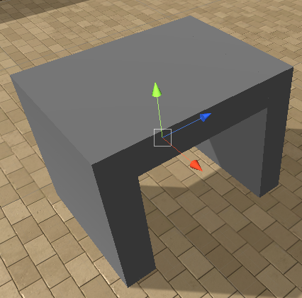
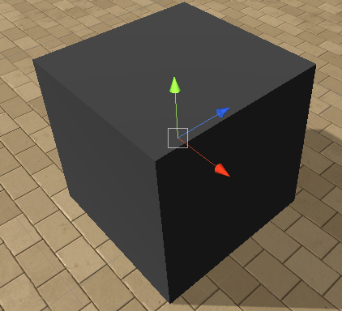
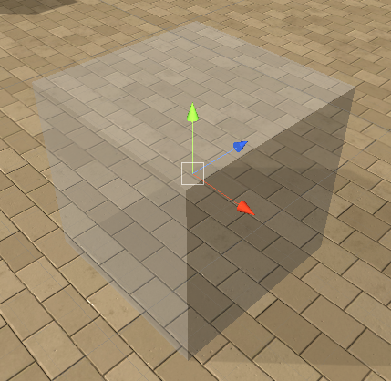
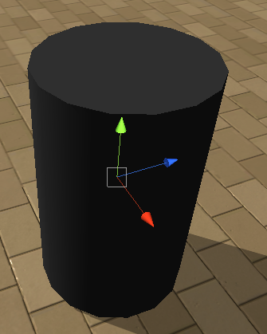

## The Objects

The objects you can spawn in an arena are split among three categories:
- movable
- immovable
- rewards

Below is a list of objects you can spawn. For each we describe the name you should use to refer to in your configuration files 
or in Python directly, as well as their default characteristics and range of values you can assign to them. **All objects can 
be rotated `360` degrees.**

Each object has an orientation, we provide the three axes for all of those that are not symmetrical. The color code of the 
axes is as depicted below:

**Note:** as depicted above the vertical axis is th **Y axis**, we will use Z as the forward axis (both conventions are 
the ones used in Unity). 

#### Immovable

These are objects that are fixed and will not be impacted by the agent or other objects:

-  a rectangular tunnel
    - name: `CubeTunnel`
    - size range `(3,3,3)-(10,10,10)`
    - can randomize color
-  a cylinder tunnel
    - name: `CylinderTunnel`
    - size range `(2.5,2.5,2.5)-(5,5,5)`
    - can randomize color
-  a ramp the agent can climb on
    - name: `Ramp`
    - size range `(0.5,0.5,3)-(10,3,10)`
    - can randomize color
    - **can only spawn on the ground**
-  a wall
    - name: `Wall`
    - size range `(0.1,1,1)-(40,10,40)`
    - can randomize color
-  a transparent wall
    - name: `WallTransparent`
    - size range `(0.1,1,1)-(40,10,40)`
    - cannot randomize color
-  a randomly generated maze of size 
`16x16` with two entrances. Note this takes quite some room and will be hard to generate last on an arena.
    - name: `MazeGenerator`
    - size range constant
    - can randomize color
    
#### Movable

These are objects the agent can move and which will be affected by each other, fixed objects and rewards if they collide
     
-  a cube that can be pushed
    - name: `Cube`
    - size range `(1,1,1)-(10,10,10)`
    - can randomize color
-  a transparent cube that can be pushed
    - name: `CubeTransparent`
    - size range `(1,1,1)-(10,10,10)`
    - cannot randomize color
-  a cardbox that can be pushed
    - name: `Cardbox1`
    - size range `(1,1,1)-(10,10,10)`
    - cannot randomize color
-  a cardbox that can be pushed
    - name: `Cardbox2`
    - size range `(1,1,1)-(10,10,10)`
    - cannot randomize color
-  a cylinder
    - name: `Cylinder`
    - size range `(1,1,1)-(10,10,10)`
    - can randomize color
-  a wood log
    - name: `WoodLog`
    - size range `(1,1,1)-(10,10,10)`
    - cannot randomize color
-  a U-shaped object
    - name: `UObject`
    - size range `(1,0.3,3)-(5,2,20)`
    - cannot randomize color
-  a L-shaped object
    - name: `LObject`
    - size range `(1,0.3,3)-(5,2,20)`
    - cannot randomize color
    
#### Rewards

Objects that may terminate the event if the agents collides with one. **Important note:** for sphere goals the `y` and `z` 
components of the provided sizes are ignored and only the `x` one counts

- Good goals: green spheres with a positive reward equal to their size, terminate an episode
    -  Fixed good reward
        - name: `GoodGoal`
        - size range `0.5-5`
         
    - A good reward moving in a straight line,
     which stops moving as soon as it hits another object. Will start moving in the direction provided by the rotation 
     parameter
        - name: `GoodGoalMove`
        - size range `1-3`
         
    -  A good reward bouncing on objects. Will
     start moving in the direction provided by the rotation parameter
        - name: `GoodGoalBounce`
        - size range `1-3`
         
- Bad goals: red spheres with a negative reward equal to their size, terminate an episode
    -   Fixed bad reward
        - name: `BadGoal`
        - size range `(0.5,0.5,0.5)-(5,5,5)`
         
    -   A bad reward moving in a straight line,
     which stops moving as soon as it hits another object. Will start moving in the direction provided by the rotation 
     parameter
        - name: `BadGoalMove`
        - size range `1-3`
         
    -  A bad reward bouncing on objects. Will 
    start moving in the direction provided by the rotation parameter
        - name: `BadGoalBounce`
        - size range `1-3`
         
-  Good goals multi: golden spheres with a positive reward equal to their size, that will only terminate the episode once
 all of them are retrieved (and a GoodGoal if present):
    -  Fixed good reward multi
        - name: `GoodGoalMulti`
        - size range `(0.5,0.5,0.5)-(10,10,10)`
         
    -  A good reward moving in a straight
     line, which stops moving as soon as it hits another object. Will start moving in the direction provided by the 
     rotation parameter
        - name: `GoodGoalMultiMove`
        - size range `1-3`
    -  A bad reward bouncing on objects. 
    Will start moving in the direction provided by the rotation parameter
        - name: `GoodGoalMultiBounce`
        - size range `1-3`
- Deathzone: 
    - a  a deathzone with reward -1
        - name: `DeathZone`
        - size range `(1,0,1)-(40,0,40)`
        - **the deathzone is always flat and located on the ground**
        - terminates episode

