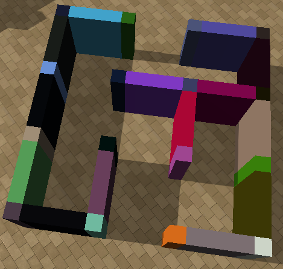
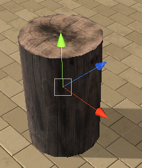

## The Objects

The objects you can spawn in an arena are split among three categories:
- movable
- immovable
- rewards

Below is a list of objects you can spawn. For each we describe the name you should use in your configuration files 
or in Python directly, as well as their default characteristics and the range of values you can assign to them. **All objects can be rotated `360` degrees.**

Each object has an orientation, we provide the three axes for all of those that are not symmetrical. The color code of the axes is as depicted below:

**Note:** the **Y axis** is the vertical axis and **Z** is the forward axis (following conventions used in Unity). 

#### Immovable

These objects are fixed and cannot be moved:

- a cylinder tunnel
    - name: `CylinderTunnel`
    - size range `(2.5,2.5,2.5)-(5,5,5)`
    - can randomize color
- a transparent cylinder tunnel
    - name: `CylinderTunnelTransparent`
    - size range `(2.5,2.5,2.5)-(5,5,5)`
    - cannot randomize color
- a ramp the agent can climb on
    - name: `Ramp`
    - size range `(0.5,0.1,0.5)-(40,10,40)`
    - can randomize color
- a wall
    - name: `Wall`
    - size range `(0.1,0.1,0.1)-(40,10,40)`
    - can randomize color
- a transparent wall
    - name: `WallTransparent`
    - size range `(0.1,0.1,0.1)-(40,10,40)`
    - cannot randomize color
<!-- - a randomly generated maze of size 
`16x16` with two entrances. Note this takes quite some room and will be hard to generate last on an arena.
    - name: `MazeGenerator`
    - size range constant
    - can randomize color -->
    
#### Movable

These are objects the agent can move and which will be affected by each other, fixed objects and rewards if they collide.
Note that different object types weight different amounts. Also note that since v0.6, all movable object have a fixed 
texture in order to make them easier to differentiate from non movable objects.
     

- a light cardbox that can be pushed
    - name: `Cardbox1`
    - size range `(0.5,0.5,0.5)-(10,10,10)`
    - cannot randomize color
- a heavier cardbox that can be pushed
    - name: `Cardbox2`
    - size range `(0.5,0.5,0.5)-(10,10,10)`
    - cannot randomize color
- a U-shaped object with a wooden texture
    - name: `UObject`
    - size range `(1,0.3,3)-(5,2,20)`
    - cannot randomize color
- a L-shaped object with a wooden texture
    - name: `LObject`
    - size range `(1,0.3,3)-(5,2,20)`
    - cannot randomize color
- symmetric of the U-shaped object
    - name: `LObject2`
    - size range `(1,0.3,3)-(5,2,20)`
    - cannot randomize color
- a wood log cylinder
    - name: `WoodLog`
    - size range `(1,1,1)-(10,10,10)`
    - cannot randomize color
    
#### Rewards

Objects that give a reward and may terminate the event if the agents collides with one. **Important note:** for sphere goals the `y` and `z` components of the provided sizes are ignored and only the `x` one counts

- Good goals: green spheres with a positive reward equal to their size, terminate an episode
    - Fixed good reward
        - name: `GoodGoal`
        - size range `0.5-5`
         
    - A good reward moving in a straight line,
     which stops moving as soon as it hits another object. Will start moving in the direction provided by the rotation 
     parameter
        - name: `GoodGoalMove`
        - size range `1-3`
         
    - A good reward bouncing on objects. Will
     start moving in the direction provided by the rotation parameter
        - name: `GoodGoalBounce`
        - size range `1-3`
         
- Bad goals: red spheres with a negative reward equal to their size, terminate an episode
    -  Fixed bad reward
        - name: `BadGoal`
        - size range `0.5-5`
         
    -  A bad reward moving in a straight line,
     which stops moving as soon as it hits another object. Will start moving in the direction provided by the rotation 
     parameter
        - name: `BadGoalMove`
        - size range `1-1`
         
    - A bad reward bouncing on objects. Will 
    start moving in the direction provided by the rotation parameter
        - name: `BadGoalBounce`
        - size range `1-1`
         
-  Good goals multi: golden spheres with a positive reward equal to their size, that will only terminate the episode once
 all of them are retrieved (and a GoodGoal if present):
    - Fixed good reward multi
        - name: `GoodGoalMulti`
        - size range `0.5-10`
         
    - A good reward moving in a straight
     line, which stops moving as soon as it hits another object. Will start moving in the direction provided by the 
     rotation parameter
        - name: `GoodGoalMultiMove`
        - size range `1-3`
    - A bad reward bouncing on objects. 
    Will start moving in the direction provided by the rotation parameter
        - name: `GoodGoalMultiBounce`
        - size range `1-3`
- Deathzone: 
    - a a red zone with reward -1 that end an
    episode
        - name: `DeathZone`
        - size range `(1,0,1)-(40,0,40)`
        - **the deathzone is always flat and located on the ground**
        - terminates an episode
- HotZone: 
    - a an orange zone with reward 
    `min(-3/T,-1e-5)` that **does not** end an episode
        - name: `HotZone`
        - size range `(1,0,1)-(40,0,40)`
        - **the hotzone is always flat and located on the ground**
        - does not terminate and episode
