## The Objects

There are 7 types of object split amongst three categories:
* Immovable
    * Walls
    * Ramps
    * Tunnels
* Movable
    * Cardboard Boxes
    * Shapes
* Rewards
    * Food
    * Zones

For each object we describe the object name to be used in a configuration file or in Python directly, as well as their default characteristics and the range of values you can assign to them. **All objects can be rotated `360` degrees.**

The axis below corresponds to that shown in the images for each individual object.

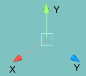

**Note:** the **Y axis** is the vertical axis and **Z** is the forward axis (following conventions used in Unity). 

## Immovable

These objects are fixed and cannot be moved:

#### Wall
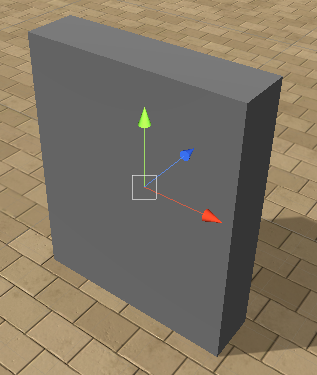

* name: `Wall`
* size range `(0.1,0.1,0.1)-(40,10,40)`
* can change color. 

For simplicity, walls in most test problems will be grey and set to RGB (r: 153, g: 153, b: 153). If a wall is used as a platform it will be blue and set to RGB (r: 0, g: 0, b: 255).

#### Transparent Wall
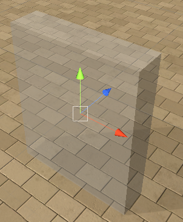

* name: `WallTransparent`
* size range `(0.1,0.1,0.1)-(40,10,40)`
* cannot change color

#### Ramp
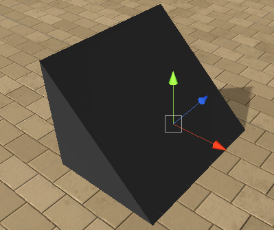

* name: `Ramp`
* size range `(0.5,0.1,0.5)-(40,10,40)`
* can change color. 

For simplicity, ramps in most test problems will be pink and set to RGB (r: 255, g: 0, b: 255).

#### Tunnel

* name: `CylinderTunnel`
* size range `(2.5,2.5,2.5)-(10,10,10)`
* can change color

For simplicity, tunnels in most test problems will be grey and set to RGB (r: 153, g: 153, b: 153).

#### Transparent Tunnel
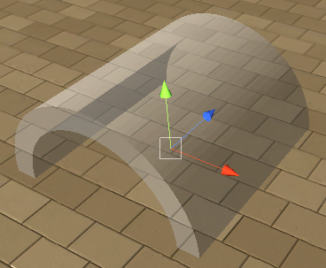

* name: `CylinderTunnelTransparent`
* size range `(2.5,2.5,2.5)-(10,10,10)`
* cannot change color
    
## Movable

These are objects that are light enough to be easily moved by the agent (or other objects). Note that different object types weigh different amounts. Also note that since v0.6, all movable object have a fixed texture in order to make them easier to differentiate from non movable objects.     

#### Light Cardboard Box
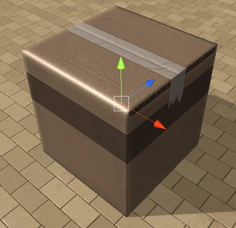

* name: `Cardbox1`
* size range `(0.5,0.5,0.5)-(10,10,10)`
* cannot change color

#### Heavy Cardboard Box
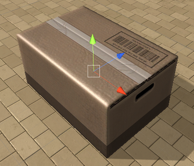

* name: `Cardbox2`
* size range `(0.5,0.5,0.5)-(10,10,10)`
* cannot change color

#### U-shaped Object
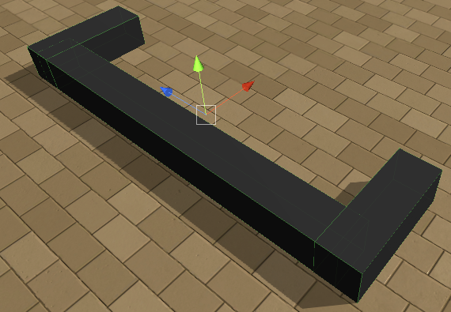

* name: `UObject`
* size range `(1,0.3,3)-(5,2,20)`
* cannot change color

#### L-shaped Object
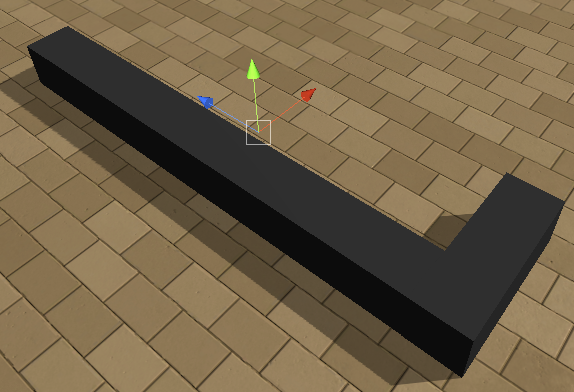a L-shaped object with a wooden texture

* name: `LObject`
* size range `(1,0.3,3)-(5,2,20)`
* cannot change color

#### L-shaped Object Variation
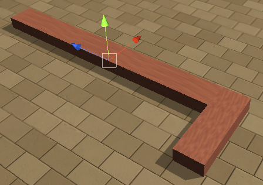symmetric of the L-shaped object
 
* name: `LObject2`
* size range `(1,0.3,3)-(5,2,20)`
* cannot change color
    
## Rewards

Objects that give a reward and may terminate the event if the agents collides with one. **Important note:** for sphere goals the `y` and `z` components of the provided sizes are ignored and only `x` is used.

#### Stationary Positive Goal
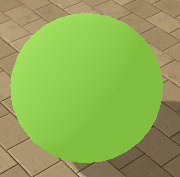
Green spheres with a positive reward equal to their size. Ends the episode on collection.

* name: `GoodGoal`
* size range `0.5-5`
* cannot change color

#### Moving Positive Goal

Moving food with positive reward. Starts by moving in the direction provided by the rotation parameter.

* name: `GoodGoalBounce`
* size range `0.5-5`
* cannot change color

#### Stationary Negative Goal
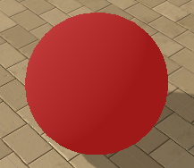
Red spheres with a negative reward equal to their size. Ends the episode on collection.
       
* name: `BadGoal`
* size range `0.5-5`
* cannot change color

#### Moving Negative Goal

Moving food with negative reward. Starts by moving in the direction provided by the rotation parameter.

* name: `BadGoalBounce`
* size range `0.5-5`
* cannot change color

#### Stationary Positive Reward
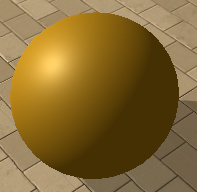
Golden spheres with a positive reward equal to their size. Does **not** terminate the episode. The episode **is** terminated if all goals are collected. So, in an episode with only these rewards the episode will terminate when the last one is obtained.

* name: `GoodGoalMulti`
* size range `0.5-5`
* cannot change color

#### Moving Positive Reward

Moving food with positive reward (non-terminating). Starts by moving in the direction provided by the rotation parameter.
   
* name: `GoodGoalMultiBounce`
* size range `0.5-5`
* cannot change color

#### Deathzone: 
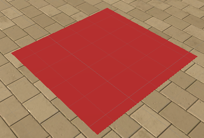
A red zone with reward -1 that terminates the episode on contact.

* name: `DeathZone`
* size range `(1,0,1)-(40,0,40)` **the deathzone is always flat and located on the ground**
* terminates an episode
* cannot change color

#### HotZone: 
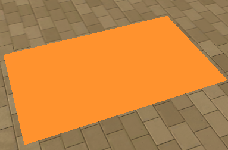
An orange zone with reward `min(-10/T,-1e-5)` (or `-1e-5` if `T=0`) that **does not** end an episode
        
* name: `HotZone`
* size range `(1,0,1)-(40,0,40)` **the hotzone is always flat and located on the ground**
* does not terminate and episode
* cannot change color
* if a `DeathZone` and a `HotZone` overlap the `DeathZone` prevails
