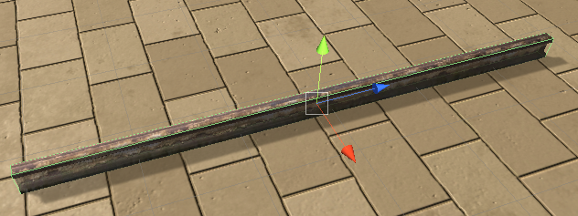
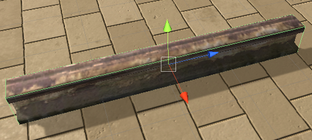
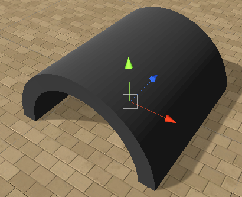
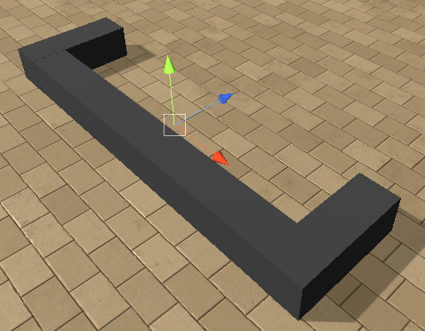
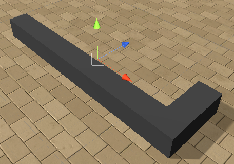

## The Objects

The objects you can spawn in an arena are split among three categories:
- movable
- immovable
- rewards

Below is a list of objects you can spawn. For each we describe the name you should use to refer to in your configuration files 
or in Python directly, as well as their default characteristics and range of values you can assign to them.

Each object has an orientation, we provide the three axes for all of those that are not symmetrical. The color code of the 
axes is as depicted below:

#### Immovable

These are objects that are fixed and will not be impacted by the agent or other objects:

-  a metal beam that sticks out of the ground
    - name: `Beam1`
    - can rotate 360 degrees
    - size range `(0.1,0.1,1)-(5,5,15)`
    - cannot randomize color
-  another metal beam that sticks out of the ground
    - name: `Beam2`
    - can rotate 360 degrees
    - size range `(0.1,0.1,1)-(5,5,15)`
    - cannot randomize color
-  a rectangular tunnel
    - name: `CubeTunnel`
    - can rotate 360 degrees
    - size range `(3,3,3)-(10,10,10)`
    - can randomize color
-  a cylinder tunnel
    - name: `Cylinder`
    - can rotate 360 degrees
    - size range `(0.5,2.5,2.5)-(5,5,5)`
    - can randomize color
-  a ramp the agent can climb on
    - name: `Ramp`
    - can rotate 360 degrees
    - size range `(0.5,0.5,0.5)-(10,5,10)`
    - can randomize color
    - **can only spawn on the ground**
-  a wall
    - name: `Wall`
    - can rotate 360 degrees
    - size range `(1,1,1)-(40,10,40)`
    - can randomize color
-  a transparent wall
    - name: `WallTransparent`
    - can rotate 360 degrees
    - size range `(1,1,1)-(40,10,40)`
    - cannot randomize color
    
#### Movable

These are objects the agent can move and which will be affected by each other, fixed objects and rewards if they collide
     
-  a cube that can be pushed
    - name: `Cube`
    - can rotate 360 degrees
    - size range `(1,1,1)-(10,10,10)`
    - can randomize color
-  a transparent cube that can be pushed
    - name: `CubeTransparent`
    - can rotate 360 degrees
    - size range `(1,1,1)-(10,10,10)`
    - cannot randomize color
-  a carbox that can be pushed
    - name: `Cardbox1`
    - can rotate 360 degrees
    - size range `(1,1,1)-(10,10,10)`
    - cannot randomize color
-  a carbox that can be pushed
    - name: `Cardbox2`
    - can rotate 360 degrees
    - size range `(1,1,1)-(10,10,10)`
    - cannot randomize color
-  a wood log
    - name: `WoodLog`
    - can rotate 360 degrees
    - size range `(1,1,1)-(10,10,10)`
    - cannot randomize color
-  a U-shaped object
    - name: `UObject`
    - can rotate 360 degrees
    - size range `(3,3,3)-(20,4,10)`
    - cannot randomize color
-  a L-shaped object
    - name: `LObject`
    - can rotate 360 degrees
    - size range `(3,3,3)-(20,4,10)`
    - cannot randomize color
    
#### Rewards

Objects that may terminate the event if the agents collides with one:

-  a good reward with reward 1
    - name: `GoodGoal`
    - can rotate 360 degrees
    - size range `(0.5,0.5,0.5)-(10,10,10)`
    - cannot randomize color
    - terminates episode
-  a bad reward with reward -1
    - name: `BadGoal`
    - can rotate 360 degrees
    - size range `(0.5,0.5,0.5)-(10,10,10)`
    - cannot randomize color
    - terminates episode
-  a deathzone with reward -1
    - name: `DeathZone`
    - can rotate 360 degrees
    - size range `(1,0,1)-(40,0,40)`
    - cannot randomize color
    - **the deathzone is always flat and located on the ground**
    - terminates episode
-  a good goal with reward 1 that will only 
terminate the episode once all of them are retrieved
    - name: `GoodGoalMulti`
    - can rotate 360 degrees
    - size range `(0.5,0.5,0.5)-(5,5,5)`
    - cannot randomize color
    - terminates episode only when all GoodGoalsMulti (and a GoodGoal if present) are collected
